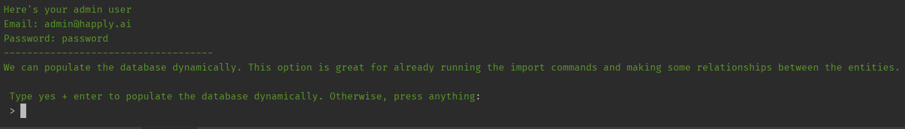
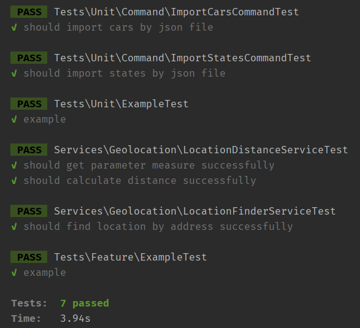

# HapplyCars Inc.
Welcome to HapplyCars project. This is a project of the Happly code assessment.

## Requirements
- [Webserver Xampp](https://www.apachefriends.org/download.html) or a docker container who does the work.
- [Database SQLite3](https://www.sqlite.org/download.html).
- [Git](https://git-scm.com/downloads).
- [Composer](https://getcomposer.org/download/).
- [Postman](https://www.postman.com/downloads/?utm_source=postman-home).

## Libs
- [Geocoder](https://packagist.org/packages/spatie/geocoder): to find the coordinates of the states by their capital city.
- [Geofence](https://packagist.org/packages/salmanzafar/laravel-geo-fence): to calculate distance measure so we can simulate a delivery and give a schedule to the user.

-----

## Installation and Configuration

## Terminal
It's fully recommended use a Git Terminal or a Linux Terminal if you want. So, for now, when we see the word `terminal` on this documentation, please consider one of them.

### Webserver 

You will need to install a server like Xampp with Apache to run PHP (or a docker container with apache).

> :bulb: **Tip:** If you are using Xampp, the repo should be cloned into htdocs folder

### Clone the repository

On `terminal`:

```
git clone git@github.com:marinapelosi/happly-cars-inc.git
```

After that, enter the project folder:

```
cd happly-cars-inc
```

Then, copy all configuration:
```
cp .env.example .env
```

### Package Dependency

Please, install the dependencies:

```
composer install
```


### Database 

Now we need to configure the database.

> :bulb: Here a [helpful documentation](https://www.servermania.com/kb/articles/install-sqlite) to install SQLite3.

After the database installation, we need to create a database in our project. So, using the `terminal` run:

```
touch database/database.sqlite
```

To check if everything it's ok:

```
php artisan migrate:status
```

The greatest message we could get is `Migration table not found`. Because it means Laravel has successfully detected our database connection!

> :warning: If it doesn't work, please check your SQLite3 installation.

> :bulb: If you get the “Database does not exist.” or similar error, try to follow [this documentation](https://devtonight.com/articles/how-to-fix-laravel-sqlite-database-does-not-exist-error)
 
> :bulb: If you get the "Unable to open database file", you can make the directory writable running `chmod 777 database && chmod 777 database/database.sqlite`

#### Everything ok? Great! :tada:

Now you should run all migrations and seeders:

```
php artisan migrate:fresh --seed
```

#### Automatic import: Import states.json and cars.json data instantly!
When you see this message, it's **fully recommendend** type `yes` + `press enter`, because the api will seed the database and you won't need to seed every single part. 



Yes! All extradata on json files will be imported quickly without any other action!

Nice, huh?

Plus it generates some random data to play with the API, using seeders and factories.

#### Manual import

But if you want populate by yourself, just press any key you want and the software will skip the seeding proccess.

To *manual* import extradata states.json

```
php artisan command:import-states
```

To *manual* import extradata cars.json
```
php artisan command:import-cars
```

### Run unit tests

The API got some tests, so you can run using the following command:

```
php artisan test
```



### Run the project

Finally, run the project:

```
php artisan serve
```

-----
## Architecture

Before the API Usage instructions, it's important to know the structure of it.

### First Impression
- Foto do primeiro diagrama (verificar o lance da localizacao dos usuarios ter voltado de 1 pra n)
- Descrever fluxo básico de cardinalidade

### Entity Relation (Database modeling)
- Foto do diagrama do banco de dados e seus

-----

## Usage

### URL

When the server is started, it will give you the local url with the port on terminal. The localhost url is often:

```
http://127.0.0.1:8000
```

But, it's important to check if it's right.

### Postman Files

You can import the postman files to help you play faster with the api.

#### Environment
@TODO export envs e anexar aqui

#### Collection (with endpoints)
@TODO export envs e anexar aqui

### Process Flow
Before using the endpoints, it's important to understand the end-to-end flow.
Fluxo para chegar no cadastro da delivery
tentar fazer diagrama

### Endpoints

- Foto com o php artisan route:list
- Listar cada endpoint e explicar, passar payload de entrada e saída


-----
- Considerações finais 
(acompanhar o projeto no jira), 
- Insights pro futuro: pattern, para mais segurança UUID, mais testes unitários

- Agradecimentos
- coisas que podem ser melhores: patterns, métodos de alteração, blabla, policys
- Listar o retorno das collections com os relacionamentos

