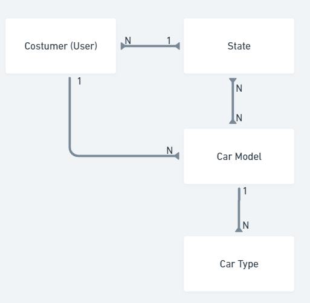
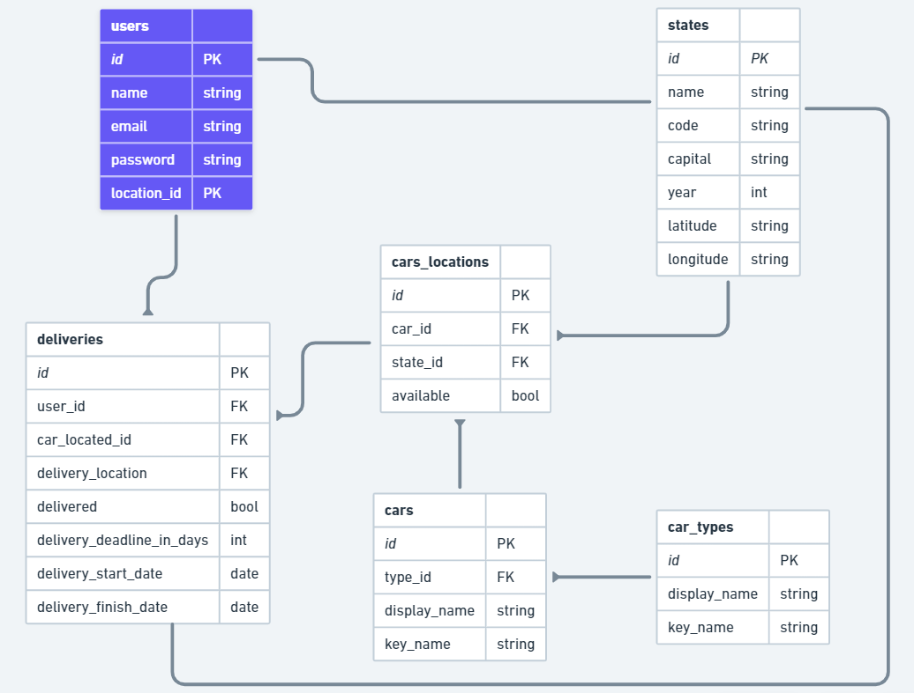
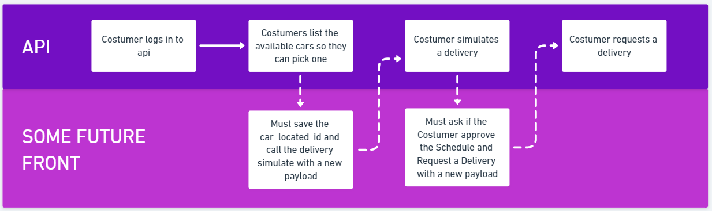

# HapplyCars Inc.
Welcome to HapplyCars project. This is a project of the Happly code assessment.

## JIRA
This project was developed using SCRUM and you can follow all the process development flow on 
this [JIRA Link](https://happly-pelosi-test.atlassian.net/jira/software/projects/HAP/boards/1).

## Requirements
- [Webserver Xampp](https://www.apachefriends.org/download.html) or a docker container who does the work.
- [Database SQLite3](https://www.sqlite.org/download.html).
- [Git](https://git-scm.com/downloads).
- [Composer](https://getcomposer.org/download/).
- [Postman](https://www.postman.com/downloads/?utm_source=postman-home).

## Libs
- [Geocoder](https://packagist.org/packages/spatie/geocoder): to find the coordinates of the states by their capital city.
- [Geofence](https://packagist.org/packages/salmanzafar/laravel-geo-fence): to calculate distance measure so we can simulate a delivery and give a schedule to the user.

-----

## Installation and Configuration

## Terminal
It's fully recommended use a Git Terminal or a Linux Terminal if you want. So, for now, when we see the word `terminal` on this documentation, please consider one of them.

### Webserver 

You will need to install a server like Xampp with Apache to run PHP (or a docker container with apache).

> :bulb: **Tip:** If you are using Xampp, the repo should be cloned into htdocs folder

### Clone the repository

On `terminal`:

```
git clone git@github.com:marinapelosi/happly-cars-inc.git
```

After that, enter the project folder:

```
cd happly-cars-inc
```

Then, copy all configuration:
```
cp .env.example .env
```

### Package Dependency

Please, install the dependencies:

```
composer install
```


### Database 

Now we need to configure the database.

> :bulb: Here a [helpful documentation](https://www.servermania.com/kb/articles/install-sqlite) to install SQLite3.

After the database installation, we need to create a database in our project. So, using the `terminal` run:

```
touch database/database.sqlite
```

To check if everything it's ok:

```
php artisan migrate:status
```

The greatest message we could get is `Migration table not found`. Because it means Laravel has successfully detected our database connection!

> :warning: If it doesn't work, please check your SQLite3 installation.

> :bulb: If you get the “Database does not exist.” or similar error, try to follow [this documentation](https://devtonight.com/articles/how-to-fix-laravel-sqlite-database-does-not-exist-error)
 
> :bulb: If you get the "Unable to open database file", you can make the directory writable running `chmod 777 database && chmod 777 database/database.sqlite`

#### Everything ok? Great! :tada:

Now you should run all migrations and seeders:

```
php artisan migrate:fresh --seed
```

#### Automatic import: Import states.json and cars.json data instantly!
When you see this message, it's **fully recommendend** type `yes` + `press enter`, because the api will seed the database and you won't need to seed every single part. 


Yes! All extradata on json files will be imported quickly without any other action!

Nice, huh?

Plus it generates some random data to play with the API, using seeders and factories.

#### Manual import

But if you want populate by yourself, just press any key you want and the software will skip the seeding proccess.

To *manual* import extradata states.json

```
php artisan command:import-states
```

To *manual* import extradata cars.json
```
php artisan command:import-cars
```

### Run unit tests

The API got some tests, so you can run using the following command:

```
php artisan test
```


### Run the project

Finally, run the project:

```
php artisan serve
```

-----
## Architecture

Before the API Usage instructions, it's important to know the structure of it.

### First Impression


### Entity Relation (Database modeling)


-----

## Usage

### Postman Files to play with the API

Import the postman files and set the HapplyCars environment, then it should be working.

Just pay attention if your Laravel Url is the same of the environment after you start the server.

[Download Postman Environment Config](doc/HapplyCars.postman_environment)

#### Collection (with endpoints)
[Download Postman Collection Config](doc/HapplyCars Inc.postman_collection)

> :bulb: It's easier because is already configured to get the auth token and apply into the request when you use the Login User Request!

### Process Flow

Before using the endpoints, it's important to understand the end-to-end flow to make a delivery request.




### Endpoints

| Group      | Method | URI                   | Auth? |       Permission | Action                       |
|:-----------|:------:|-----------------------|------:|-----------------:|:-----------------------------|
| User       |  POST  | api/login             |    No |              Any | Login                        |
| User       |  POST  | api/logout            |   Yes |              Any | Logout                       |
| User       |  POST  | api/costumers         |   Yes |       Only Admin | Create Costumer User         |
| User       |  GET   | api/costumers         |   Yes |  Any (has rules) | List Users                   |
| User       |  GET   | api/costumers/{id}    |   Yes |  Any (has rules) | Show a single User           |  
| Car        |  GET   | api/available-cars    |   Yes |              Any | List Available Cars          |
| Car        |  GET   | api/unavailable-cars  |   Yes |              Any | List Unavailable Cars        |
| Car        |  GET   | api/cars              |   Yes |              Any | List Cars                    |
| State      |  GET   | api/states            |   Yes |              Any | List States                  |
| Delivery   |  POST  | api/delivery-schedule |   Yes |              Any | Simulate a delivery schedule |
| Delivery   |  POST  | api/deliveries        |   Yes |  Any (has rules) | Request a Delivery           |
| Delivery   |  GET   | api/deliveries        |   Yes |  Any (has rules) | List Deliveries              |
| Delivery   |  GET   | api/deliveries/{id}   |   Yes | Any (has rules)  | Show a single Delivery       |

---
#### POST api/login

Validate the user and generate a token to auth into the API.

Payload
``` 
{
    "email": "<some email>",
    "password": "<some password>"
}
```

Output
``` 
{
    "token": "7|Ii6bD00DmKKBSCofRh2GfgT5AD4MtHXfvkmxoJSD",
    "user": {
        "id": 7,
        "name": "Marina",
        "email": "maa.pelosi@gmail.com",
        "email_verified_at": null,
        "is_admin": "0",
        "current_location": {
            "id": 34,
            "name": "New York",
            "code": "NY",
            "capital": "Albany",
            "year": "1788",
            "latitude": "42.6525793",
            "longitude": "-73.7562317"
        },
        "deliveries": []
    }
}
```

---

#### POST api/logout

Logout the user

---

#### POST api/costumers

Easily creates a Costumer User and generate a valid access token to the API.

Payload
``` 
{
    "name": "<some name>",
    "email": "<some email>",
    "password": "<some password>",
    "state": "<field code of table states>"
}
```

Output
``` 
{
    "status": 201,
    "message": "Created successfully",
    "user": {
        "id": 9,
        "name": "Marina",
        "email": "maa.pelosi@gmail.coam",
        "email_verified_at": null,
        "is_admin": "0",
        "current_location": {
            "id": 34,
            "name": "New York",
            "code": "NY",
            "capital": "Albany",
            "year": "1788",
            "latitude": "42.6525793",
            "longitude": "-73.7562317"
        },
        "deliveries": []
    }
}
```

---

#### GET api/costumers or api/costumers/{id}

Gets a list of costumers or just for a single one.
Rule: If the users are not admins, they just can see themselves data. Admins can see all users.

Output
``` 
{
    "status": 201,
    "user": [
        {
            "id": 9,
            "name": "Josh",
            "email": "josh@gmail.com",
            "email_verified_at": null,
            "is_admin": "0",
            "current_location": {
                "id": 34,
                "name": "New York",
                "code": "NY",
                "capital": "Albany",
                "year": "1788",
                "latitude": "42.6525793",
                "longitude": "-73.7562317"
            },
            "deliveries": []
        },
        {
            "id": 7,
            "name": "Marina",
            "email": "maa.pelosi@gmail.com",
            "email_verified_at": null,
            "is_admin": "0",
            "current_location": {
                "id": 34,
                "name": "New York",
                "code": "NY",
                "capital": "Albany",
                "year": "1788",
                "latitude": "42.6525793",
                "longitude": "-73.7562317"
            },
            "deliveries": [
                {
                    "id": 11,
                    "delivery_location": "{\"id\":6,\"name\":\"California\",\"code\":\"CA\",\"capital\":\"Sacramento\",\"year\":\"1850\",\"latitude\":\"38.5815719\",\"longitude\":\"-121.4943996\"}",
                    "delivered": "1",
                    "delivery_deadline_in_days": "0",
                    "delivery_start_date": "2023-05-21T00:53:45.446509Z",
                    "delivery_finish_date": "2023-05-21 00:53:45",
                    "car": {
                        "id": 1,
                        "available": "0",
                        "model": {
                            "id": 49,
                            "display_name": "4000",
                            "key_name": "4000",
                            "type": {
                                "id": 5,
                                "display_name": "Audi",
                                "key_name": "audi"
                            }
                        },
                        "state": {
                            "id": 25,
                            "name": "Minnesota",
                            "code": "MN",
                            "capital": "Saint Paul",
                            "year": "1858",
                            "latitude": "44.9537029",
                            "longitude": "-93.0899578"
                        }
                    }
                }
            ]
        },
    ]
}
```

---

#### GET api/available-cars or api/available-cars

List available or unavailable cars. The difference is just the status.

Output
``` 
{
    "status": 200,
    "cars": [
        {
            "id": 3,
            "available": "1",
            "model": {
                "id": 58,
                "display_name": "A8",
                "key_name": "a8",
                "type": {
                    "id": 5,
                    "display_name": "Audi",
                    "key_name": "audi"
                }
            },
            "state": {
                "id": 21,
                "name": "Maine",
                "code": "ME",
                "capital": "Augusta",
                "year": "1820",
                "latitude": "44.3106241",
                "longitude": "-69.7794897"
            }
        }
    ]
}
```

---

#### GET api/cars

List cars imported (cars.json) with all properties like type and location. Remember: the first information is of the car model.

Output
``` 
{
    "cars": [
        {
            "id": 1,
            "display_name": "CL Models (4)",
            "key_name": "cl_models",
            "type": {
                "id": 1,
                "display_name": "Acura",
                "key_name": "acura"
            },
            "location": [
                {
                    "id": 100,
                    "available": "1",
                    "state": {
                        "id": 29,
                        "name": "Nebraska",
                        "code": "NE",
                        "capital": "Lincoln",
                        "year": "1867",
                        "latitude": "40.813616",
                        "longitude": "-96.7025955"
                    }
                },
                {
                    "id": 193,
                    "available": "1",
                    "state": {
                        "id": 37,
                        "name": "Northern Mariana Islands",
                        "code": "MP",
                        "capital": "Saipan",
                        "year": "1947",
                        "latitude": "37.09024",
                        "longitude": "-95.712891"
                    }
                },
            ]
        },
]
```

---

#### GET api/states

List all imported (states.json) states with the latitude and longitude calculated.

Output
``` 
{
    "states": [
        {
            "id": 1,
            "name": "Alabama",
            "code": "AL",
            "capital": "Montgomery",
            "year": "1819",
            "latitude": "32.3792233",
            "longitude": "-86.3077368"
        },
]
```

---

#### POST api/delivery-schedule

Simulate a delivery and gives the user a estimated schedule. Also generates a payload that could be used to request a delivery in the next endpoint.

Payload
``` 
{
    "car_located_id": 1,
    "delivery_location_code": "CA",
    "delivery_start_date": "2023-05-19 00:00:00",
    "accepts_the_proposed_schedule": true
}
``` 

Output
``` 
{
    "status": 201,
    "message": "Yeah! Will be delivered Today!",
    "schedule": {
        "origin": "Saint Paul, MN",
        "destination": "Albany, NY",
        "delivery_start_date": "2023-05-21T03:17:07.424628Z",
        "estimated_due": {
            "miles": 974,
            "parameter": "miles",
            "delivery_due": 0,
            "delivery_due_message": "Yeah! Will be delivered Today!"
        },
        "car": {
            "id": 1,
            "available": "0",
            "model": {
                "id": 49,
                "display_name": "4000",
                "key_name": "4000",
                "type": {
                    "id": 5,
                    "display_name": "Audi",
                    "key_name": "audi"
                }
            },
            "state": {
                "id": 25,
                "name": "Minnesota",
                "code": "MN",
                "capital": "Saint Paul",
                "year": "1858",
                "latitude": "44.9537029",
                "longitude": "-93.0899578"
            }
        },
        "user": {
            "id": 7,
            "name": "Marina",
            "email": "maa.pelosi@gmail.com",
            "email_verified_at": null,
            "is_admin": "0",
            "current_location": {
                "id": 34,
                "name": "New York",
                "code": "NY",
                "capital": "Albany",
                "year": "1788",
                "latitude": "42.6525793",
                "longitude": "-73.7562317"
            }
        }
    },
    "payload_to_request": {
        "accepts_the_proposed_schedule": true,
        "car_located_id": 1,
        "delivery_location_code": "CA",
        "delivery_deadline_in_days": 0,
        "delivery_start_date": "2023-05-21T03:17:07.424628Z"
    }
}
```

---

#### POST api/delivery-schedule

Create a real delivery request and "simulate" is already delivered.

Payload
``` 
{
    "accepts_the_proposed_schedule": true, // just to remember that the front needs to ask the user on the simulation if they want to continue to request a delivery
    "car_located_id": 1,
    "delivery_location_code": "CA",
    "delivery_deadline_in_days": 0,
    "delivery_start_date": "2023-05-21T00:53:45.446509Z"
}
``` 

Output
``` 
{
    "status": 201,
    "message": "1, 2, 3... lets pretend all the schedule was finished and our future crons updated all data... bum! The car was delivered to you! What a nice thing, huh?",
    "delivery": [
        {
            "id": 13,
            "delivery_location": "{\"id\":6,\"name\":\"California\",\"code\":\"CA\",\"capital\":\"Sacramento\",\"year\":\"1850\",\"latitude\":\"38.5815719\",\"longitude\":\"-121.4943996\"}",
            "delivered": "1",
            "delivery_deadline_in_days": "0",
            "delivery_start_date": "2023-05-21T00:53:45.446509Z",
            "delivery_finish_date": "2023-05-21 00:53:45",
            "user": {
                "id": 7,
                "name": "Marina",
                "email": "maa.pelosi@gmail.com",
                "email_verified_at": null,
                "is_admin": "0"
            },
            "car": {
                "id": 1,
                "available": "0",
                "model": {
                    "id": 49,
                    "display_name": "4000",
                    "key_name": "4000",
                    "type": {
                        "id": 5,
                        "display_name": "Audi",
                        "key_name": "audi"
                    }
                },
                "state": {
                    "id": 25,
                    "name": "Minnesota",
                    "code": "MN",
                    "capital": "Saint Paul",
                    "year": "1858",
                    "latitude": "44.9537029",
                    "longitude": "-93.0899578"
                }
            }
        }
    ]
}
```

---

#### GET api/costumers or api/costumers/{id}

Gets a list of costumers or just for a single one.
Rule: If the users are not admins, they just can see themselves data. Admins can see all users.

Output
``` 
{
    "deliveries": [
        {
            "id": 13,
            "delivery_location": "{\"id\":6,\"name\":\"California\",\"code\":\"CA\",\"capital\":\"Sacramento\",\"year\":\"1850\",\"latitude\":\"38.5815719\",\"longitude\":\"-121.4943996\"}",
            "delivered": "1",
            "delivery_deadline_in_days": "0",
            "delivery_start_date": "2023-05-21T00:53:45.446509Z",
            "delivery_finish_date": "2023-05-21 00:53:45",
            "user": {
                "id": 7,
                "name": "Marina",
                "email": "maa.pelosi@gmail.com",
                "email_verified_at": null,
                "is_admin": "0"
            },
            "car": {
                "id": 1,
                "available": "0",
                "model": {
                    "id": 49,
                    "display_name": "4000",
                    "key_name": "4000",
                    "type": {
                        "id": 5,
                        "display_name": "Audi",
                        "key_name": "audi"
                    }
                },
                "state": {
                    "id": 25,
                    "name": "Minnesota",
                    "code": "MN",
                    "capital": "Saint Paul",
                    "year": "1858",
                    "latitude": "44.9537029",
                    "longitude": "-93.0899578"
                }
            }
        }
    ]
}
```

---

-----

## Final comments

There are tons of insights for improvement in the future. For example:

- We could improve the admin validation using Policies.
- We could add more unit tests, patterns, and security.
- Features are welcome like update a costumer or cancel a delivery not finished.
- Jobs would be great to manage the process of delivery.

## Thanks!

I hope you enjoy.
